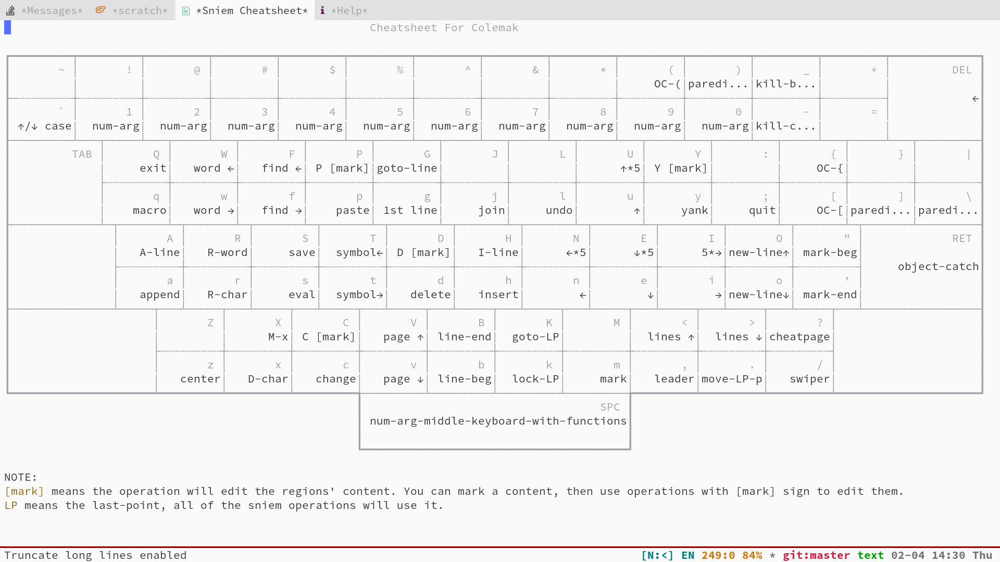

# Sniem

Sniem is **S**imple u**ni**ted **e**dition **m**ethod. This edition method included some good ideas from `evil` and `meow`.  

## Screenshot



## Installation

```emacs-lisp
(use-package sniem
  :load-path "/path/to/sniem"
  :init (global-sniem-mode t)
  :config
  (sniem-set-keyboard-layout 'qwerty))
```

## Introduce

### Modes

Sniem includes 3 modes:

- `NORMAL`: This mode is the default mode for the editing buffers.
- `INSERT`: This mode will be used when you executed `sniem-insert` in `NORMAL` mode. It's used to edit. In this mode, there's only one binding for `sniem`, that is `<ESC>` which will make you exit `INSERT` mode back to `NORMAL` mode.
- `MOTION`: This mode is used in special modes, there's only has one binding for `sniem`, that is `<SPC>` which can let you use leader keys.

### Keyboard Layout

You can use `(sniem-set-keyboard-layout)` to set your keyboard layout for `sniem`, then `sniem` will bind the default keys for the keyboard layout.  
Now, the `QWERTY`, `Colemak`, `Dvorak` and `Dvorak Programmer` layouts are supported.

e.g.:
```emacs-lisp
(sniem-set-keyboard-layout 'qwerty)
(sniem-set-keyboard-layout 'colemak)
(sniem-set-keyboard-layout 'dvorak)
(sniem-set-keyboard-layout 'dvp) ; For Dvorak Programmer
```

### Functions

- `(sniem-leader-set-key)` - Set the keys for leader keymap.
- `(sniem-normal-set-key)` - To set keys for normal mode keymap.
- `(sniem-set-quit-insert-key)` - To set the key for `(sniem-quit-insert)` in `INSERT` mode.

## LICENSE
GPL-3.0
